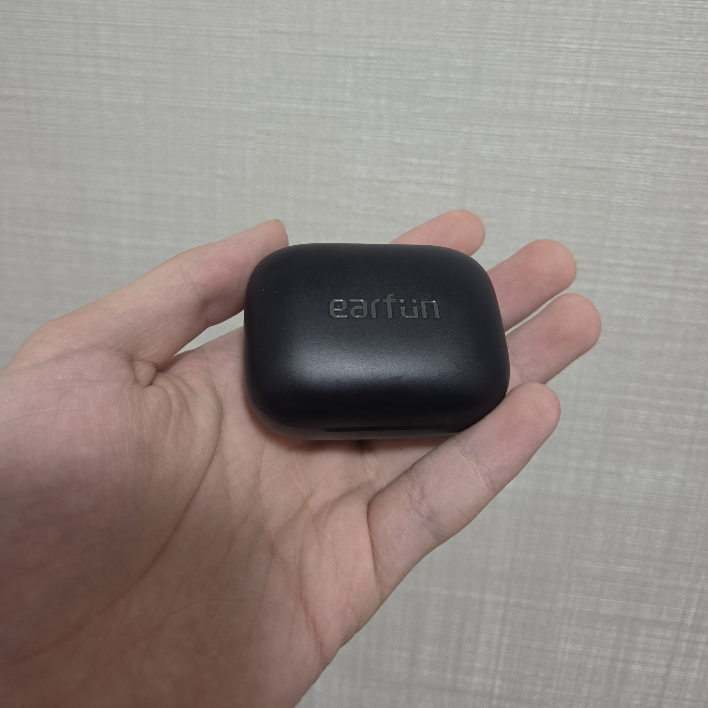
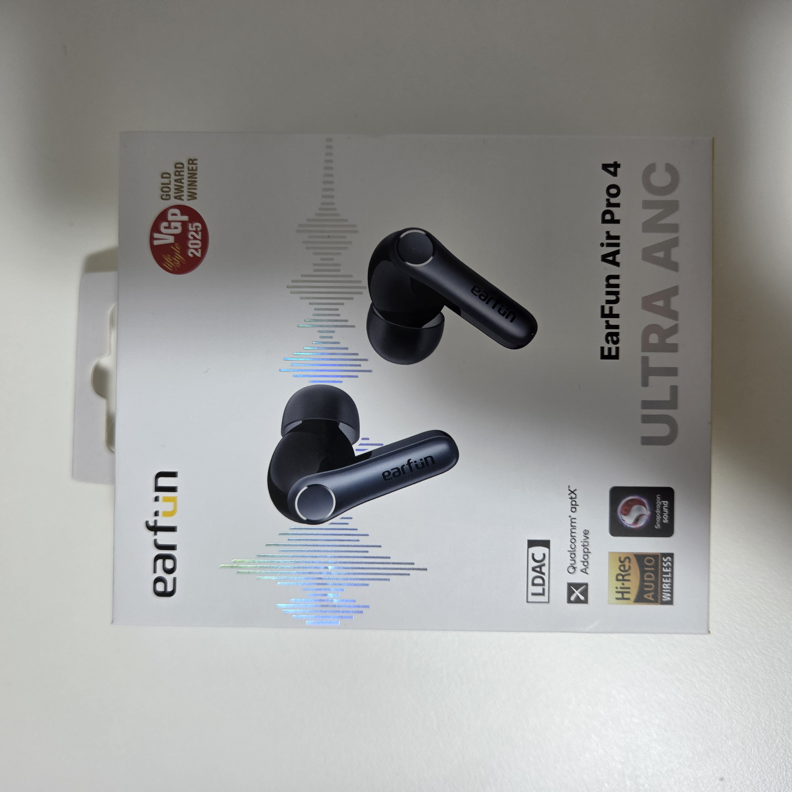
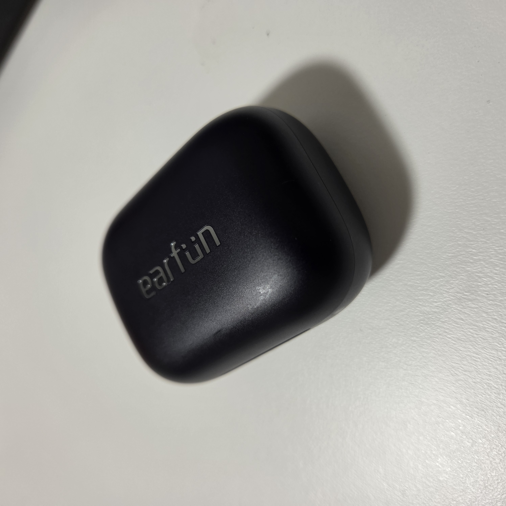
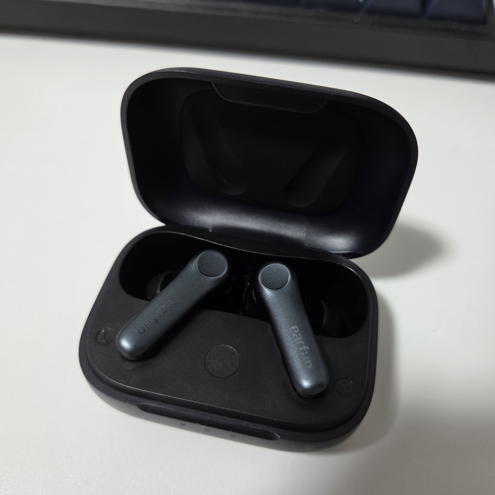
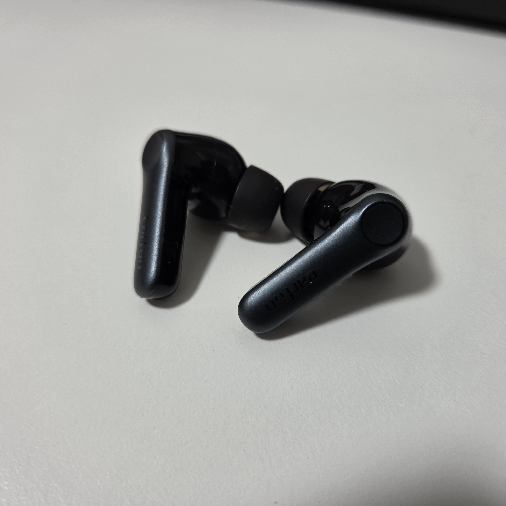
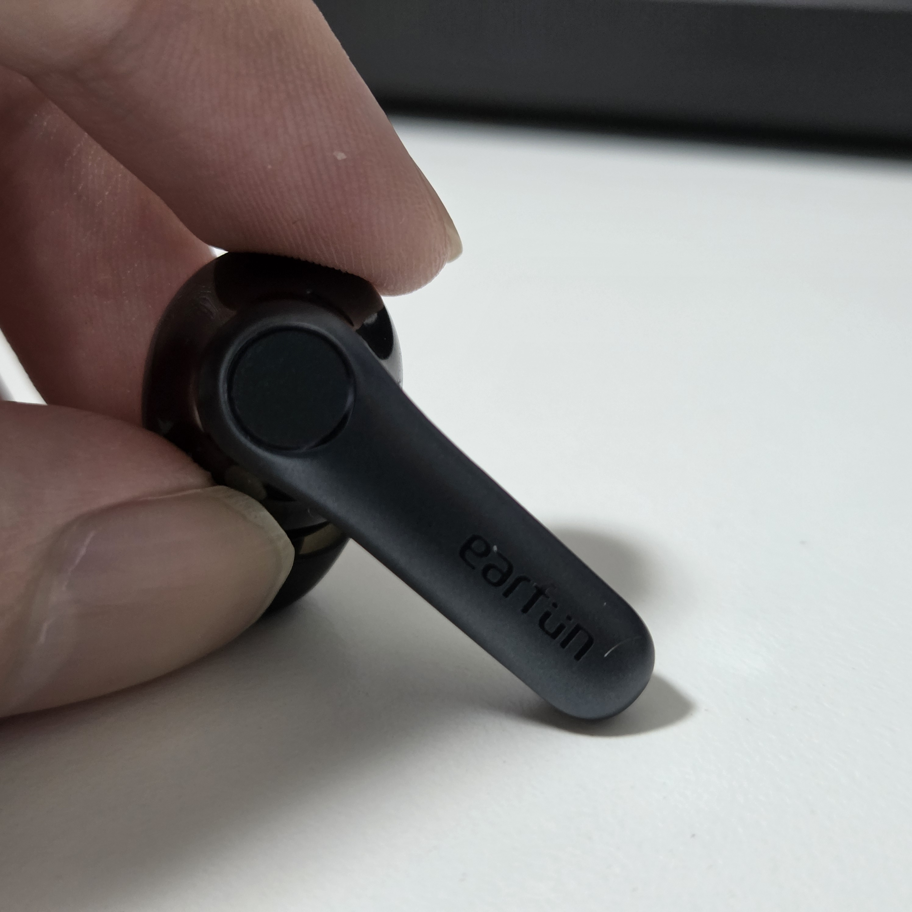

## 買っちゃった！

前に使っていたイヤホンがぶっ壊れたので、半ば泣く泣く購入したのが、

**EarFun Air Pro 4**

です。（タイトルにもある通りですね）

## 外観とか…

箱です。

ケースです。

パカってしたところ。

イヤホン本体です。

サイドです。

## スペック

| 項目         | 仕様                                                        |
| ---------- | --------------------------------------------------------- |
| ドライバー      | 10mm径 複合振動板ダイナミックドライバー                                    |
| Bluetooth  | Bluetooth 5.4                                             |
| 対応コーデック    | aptX Adaptive、aptX Lossless、LDAC、LC3、SBC                  |
| ノイズキャンセリング | QuietSmart 3.0（最大50dB）                                    |
| マイク        | 6基（AIノイズ低減・cVc 8.0対応）                                     |
| 連続再生時間     | ANCオフ：最大11時間（ケース込み最大52時間） / ANCオン：最大7.5時間（ケース込み最大35時間）    |
| バッテリー容量    | イヤホン：54mAh × 2 / 充電ケース：600mAh                             |
| 充電時間       | イヤホン：約1時間 / ケース：約2時間（USB-C）、約3.5時間（ワイヤレス充電）               |
| 急速充電       | 10分の充電で約2時間再生                                             |
| 通信距離       | 最大15m（障害物がない場合）                                           |
| 防水性能       | IPX5                                                      |
| 低遅延モード     | 50ms未満                                                    |
| サイズ        | 62.4 × 46.6 × 29.2mm（ケース）                                 |
| 重量         | 56g（ケースを含む）                                               |
| その他        | マルチポイント、装着検出、Google Fast Pair、ワイヤレス充電、LE Audio・Auracast対応 |

かなり機能が盛られています。特にaptX LosslessとLDACの両対応に加え、マルチポイントやワイヤレス充電まで揃っているのはうれしいところですね。

## 音について

私はおバカさんなお耳を持っているので、詳しいことや的確なことは言えません。

あくまで「こんな感じ」っていうものだと捉えてほしいです。（保身）

**音がいいです！！！！！**

その音の良さについて掘り下げます。結構浅く。

なんていうか、全体的にバランスの良い音です。どこかが抜けているという感覚もなく、ちゃんと鳴ってるなぁって。

ボーカルが埋もれたり、高音が刺さったりすることもなく、低音が弱いということもなく……。

うん。そうとしか言いようがないです。ｺﾞﾒﾝﾈ。

前に使っていた**Nothing Ear (3)**（だいたい2.5万円）と比較しても、遜色がないってレベルです。

## コスパ

値段は9,900円です。

安いね。

## 気になりポイント

気になったポイントです。

### タッチコントロールがちょっと微妙？

前に使っていたEar (3)は「つまむ」ことで操作していたんですけど、Air Pro 4はタッチ操作なので、横になってゴロゴロしていると耳たぶなどに反応してしまいます。これはちょっと微妙だなって。

結局設定で

- 2回タップ：再生・一時停止
- 3回タップ：次の曲

にしました。1回タップと長押しは無効にしています。

自衛できる範囲の気になりポイントでした。

### 電磁波に弱い？

動いている電子レンジに近付くと接続が不安定になります。

ちょっと意地悪な条件ではあるけど、Ear (3)だと安定していたので、少し気になりました。

## おわり

こんな感じですぅ〜。

1万円くらいで買えて、音も良い。完璧な製品ですね！ はい。

商品へのリンクは貼らんので、Amazonとかで検索してくだせぇ。
