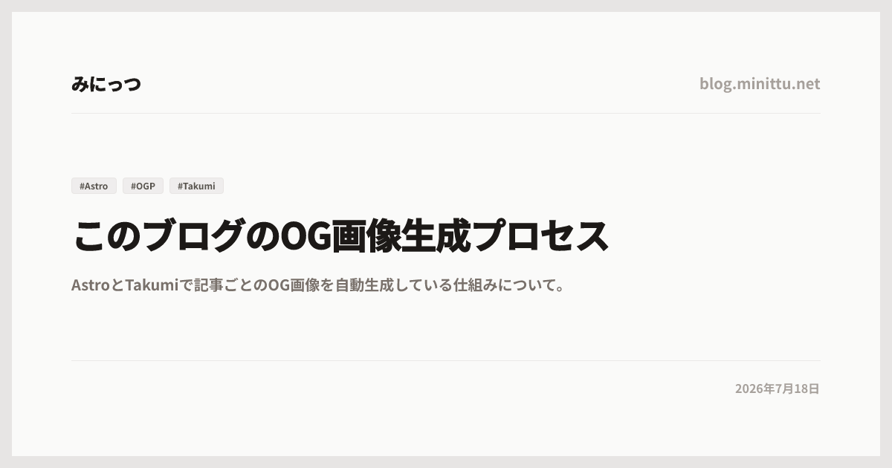

## OG画像を自動生成している

このブログでは、記事ごとのOG画像を手作業では作っていません。

記事を書いてビルドすると、`/posts/記事ID/og.png` という画像が自動で生成されます。
TwitterやMisskey、Discordなどに記事URLを貼ったときに出る、あの横長の画像です。

実際にこの記事用に生成されたOG画像はこんな感じです。



実装しているファイルはここです。

```text
src/pages/posts/[slug]/og.png.ts
```

Astroのルーティングを使って、記事ページと同じようにOG画像用のエンドポイントを生やしています。

## 全体の流れ

ざっくり書くと、処理の流れはこんな感じです。

- `getCollection('blog')` で記事一覧を読む
- `getStaticPaths()` で記事ごとの `/posts/[slug]/og.png` を生成対象にする
- 記事のタイトル、説明、タグ、日付を取り出す
- BudouXで日本語の自然な改行位置を作る
- React要素でOG画像のレイアウトを書く
- `takumi-js` の `ImageResponse` でPNGとして返す

普通のページ生成とほぼ同じ感覚で、画像生成用のルートを作っている感じです。

## Astroのルートとして画像を返す

まず、OG画像用のファイルは `src/pages/posts/[slug]/og.png.ts` に置いています。

Astroでは `src/pages` 配下のファイルがそのままルートになります。
つまりこのファイルは、最終的にこういうURLになります。

```text
/posts/hello/og.png
/posts/astro-v7-fast/og.png
```

記事ごとのパスは `getStaticPaths()` で作っています。

```ts
export async function getStaticPaths() {
  const posts = await getCollection('blog');
  return posts.map((post) => ({
    params: { slug: post.id },
    props: { post },
  }));
}
```

`getCollection('blog')` で `src/content/blog` 配下の記事を読み、各記事の `id` を `slug` として渡しています。

これで、Astroのビルド時に記事の数だけOG画像のルートが生成されます。

## 画像生成にはTakumiを使う

OG画像の生成には `takumi-js` を使っています。

```ts
import { ImageResponse } from 'takumi-js/response';
```

よくある構成だと `satori` と `resvg` を使うことが多いと思います。
ただ、このブログではRust製のレンダラーであるTakumiを使っています。

書き方はかなりシンプルで、React要素を作って `ImageResponse` に渡すだけです。

```ts
return new ImageResponse(
  React.createElement(
    'div',
    {
      className: 'w-full h-full flex flex-col justify-between p-20',
    },
    // 中身
  ),
  {
    width: 1200,
    height: 630,
    fonts: fontOptions,
    stylesheets: [stylesheet],
  }
);
```

OG画像のサイズは定番の `1200x630` にしています。
レイアウトはHTMLを書く感覚に近く、Tailwindのクラスも使っています。

## CSSはglobal.cssをそのまま読む

このブログはTailwind CSSを使っています。
OG画像側でも同じ見た目に寄せたいので、`global.css` をインラインで読み込んでいます。

```ts
import stylesheet from '../../../styles/global.css?inline';
```

そして `ImageResponse` のオプションに渡します。

```ts
stylesheets: [stylesheet],
```

これでOG画像の中でも `bg-stone-50` や `text-stone-900` のようなクラスを使えるようになります。

ブログ本体とOG画像で色や余白の感覚を揃えられるので、別でCSSを書くより管理が楽です。

## 日本語フォントを使う

日本語のOG画像で困りがちなのがフォントです。

フォント指定が適当だと、環境によって見た目が変わったり、日本語が微妙な表示になったりします。
なので、このブログでは `Noto Sans JP` のBoldを使っています。

```ts
const fontCachePath = path.resolve('src/assets/fonts/NotoSansJP-Bold.otf');
```

まずローカルにフォントファイルがあればそれを読みます。
なければGitHub上のNoto CJKから取得して、`src/assets/fonts/` にキャッシュします。

```ts
if (fs.existsSync(fontCachePath)) {
  return fs.readFileSync(fontCachePath);
}
```

初回だけ取得して、次回以降はローカルキャッシュを読む形です。

一応、フォント取得には5秒のタイムアウトも入れています。
ネットワークが死んでいるだけでブログ全体のビルドが落ちるのは嫌なので、失敗した場合は `undefined` を返してデフォルトフォントにフォールバックします。

```ts
const controller = new AbortController();
const timeoutId = setTimeout(() => controller.abort(), 5000);
```

完璧な見た目より、まずビルドが通ることを優先しています。

## BudouXで改行位置を調整する

日本語のタイトルは、変なところで改行されるとかなり気になります。

たとえば長いタイトルがあると、単語の途中で切れたり、読みづらい位置で折り返されたりします。
OG画像は一枚絵なので、ここが汚いとかなり目立ちます。

そこで `budoux` を使っています。

```ts
import { loadDefaultJapaneseParser } from 'budoux';

const parser = loadDefaultJapaneseParser();
```

タイトルと説明文をBudouXで分割します。

```ts
const titleChunks = parser.parse(displayTitle);
const descriptionChunks = parser.parse(displayDescription);
```

そして、分割された文字列の間に `<wbr>` を差し込みます。

```ts
titleChunks.flatMap((chunk, i) => [
  chunk,
  React.createElement('wbr', { key: `t-wbr-${i}` })
])
```

`wbr` は「ここなら改行してもいいよ」という目印です。

これを入れておくと、日本語でも比較的自然な位置で折り返されます。
さらにタイトルには `line-clamp-2`、説明文には `line-clamp-3` を当てて、長すぎる場合は行数を制限しています。

```ts
className: 'text-5xl font-extrabold leading-snug tracking-tight text-stone-900 line-clamp-2'
```

画像の中でテキストが暴れないようにするための処理ですね。

## レイアウトの中身

OG画像の見た目はかなりシンプルです。

- 上部にブログ名とドメイン
- 中央にタグ、タイトル、説明文
- 下部に公開日
- 背景は薄いstone系
- 外周に太めの枠線

派手な装飾はしていません。
このブログ自体がシンプルなデザインなので、OG画像もそれに合わせています。

タグは最大3件だけ表示しています。

```ts
(post.data.tags || []).slice(0, 3).map((tag: string) =>
  React.createElement(
    'span',
    { key: tag },
    `#${tag}`
  )
)
```

タグを全部出すと、記事によっては窮屈になります。
OG画像は情報量を詰め込みすぎるより、タイトルがちゃんと読めるほうが大事だと思っています。

## 記事ページからOG画像を参照する

画像を生成するだけでは意味がないので、記事ページ側のメタタグから参照します。

記事ページでは `Layout` にこう渡しています。

```astro
<Layout
  title={`${post.data.title} | みにっつのブログ`}
  description={post.data.description}
  image={`/posts/${post.id}/og.png`}
>
```

`Layout.astro` 側では、その `image` を `og:image` と `twitter:image` に入れています。

```astro
<meta property="og:image" content={new URL(image, Astro.url)} />
<meta property="twitter:image" content={new URL(image, Astro.url)} />
```

これで、記事ページをSNSなどに貼ったときに、対応するOG画像が表示されるようになります。

記事を書く側はOG画像のことを意識しなくてよくて、frontmatterの `title`、`description`、`tags`、`date` をちゃんと書けばOKです。

## よかったところ

この構成でよかったところは、記事のデータをそのまま使えることです。

OG画像用に別の設定ファイルを作ったり、画像を手で書き出したりする必要がありません。
記事を書けば、記事ページとOG画像が同時に生成されます。

あと、デザインをコードで管理できるのも楽です。
見た目を変えたくなったら `og.png.ts` を編集すれば、全記事のOG画像に反映されます。

## 気をつけるところ

便利ですが、いくつか気をつける点もあります。

まず、フォントです。
日本語フォントはサイズが大きいので、毎回ネットワークから取ると遅くなります。
このブログではローカルキャッシュするようにしています。

次に、テキスト量です。
OG画像は横長ですが、入れられる情報量は意外と少ないです。
タイトル、説明文、タグを全部出すなら、行数制限は必須だと思います。

最後に、ビルド対象です。
OG画像ルート側でも記事ページと同じように `draft` を見てフィルタしています。
これを忘れると下書き用のOG画像まで本番ビルドに含まれるため、公開ページと生成条件を揃える必要があります。

## おわり

このブログのOG画像生成は、AstroのルーティングとTakumiを組み合わせてかなり素直に作っています。

React要素でレイアウトを書いて、記事データを流し込み、`ImageResponse` でPNGとして返す。
やっていることはこれだけです。

OG画像を毎回手で作るのは面倒なので、ブログ側に組み込んでしまうのが一番楽だと思います。

それでは。
