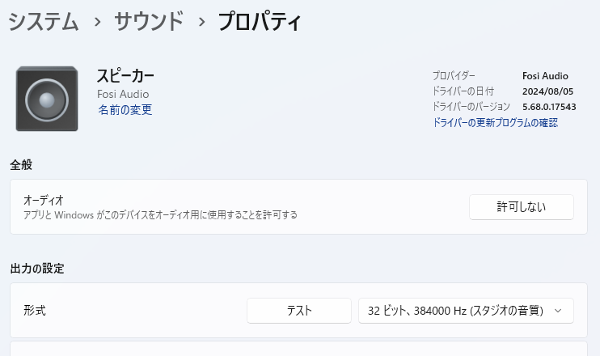

## どんな人に向けた記事？

* ゆずソフトのゲームを遊んでいて音が出ないなっていう人
* それ以外でも同じような症状が出ている人

あくまで一例です。これで解決できない原因も考えられます。

## 音が出ません！

18歳になったので18禁のゲームを遊べます。\
私にはエロゲ童貞を捧げると決めたタイトルがありました。

それはゆずソフトの「**喫茶ステラと死神の蝶**」です。\
(※R18タイトルのためリンクは貼りません！)

買って初日で全ルート攻略しました。

しかしたまにですが音が出ません。\
ゲームを再起動してもダメで、ブラウザで流している音楽は流れているのに、ゲームの音が流れないという。

## 原因はオーディオの形式

一応の原因としては**Windowsのオーディオの形式の設定**でした。24bit/48kHzみたいなやつですね。

私はこの設定を**32bit/384kHzにしていました**。これが良くなかった。

解決方法としては32bitをやめて24bit/48kHzまで落とすことでした。

多分だけどゲームエンジンと相性が悪かったのでしょう。

## 音は変わらない

正直普段生きてて32bit/384kHzに設定する恩恵は受けないと思います。

超高級機材を使用してクラシックを鑑賞するくらいじゃないと意味がないくらいには。

ストリーミングサービスを使用して音楽を聞くとしてもせいぜい24bit/96kHz程度です。(AppleMusicのロスレス)\
CDなんて16bit/44.1kHzですし、YouTubeMusicも256kbpsのopusです。

なので24bit/48kHzが一番トラブルの少ない設定です。

## なぜ32bit/384kHzにしてたか

私の使っているDACはFosiAudioのZH-3という物なんですが、コイツはたまに曲の先頭が切れます。\
これの解決方法として公式から案内されている方法が、この設定に変えるというものだったのです。

結局ドライバの修正を当てることでこの設定にしなくてもクリッピングされないようになったのですが、戻し忘れてたようです。

## おわり

以上です。この記事が役に立つことはあるのでしょうか…？

エロゲ、ゆずソフト以外もやりたいなぁと思ってます。まどソフトとか…(これ以外知らないかも)\
私は抜きゲーよりストーリー重視のものが好きです！Hシーンは無くても構いません(本末転倒)

それでは👋
